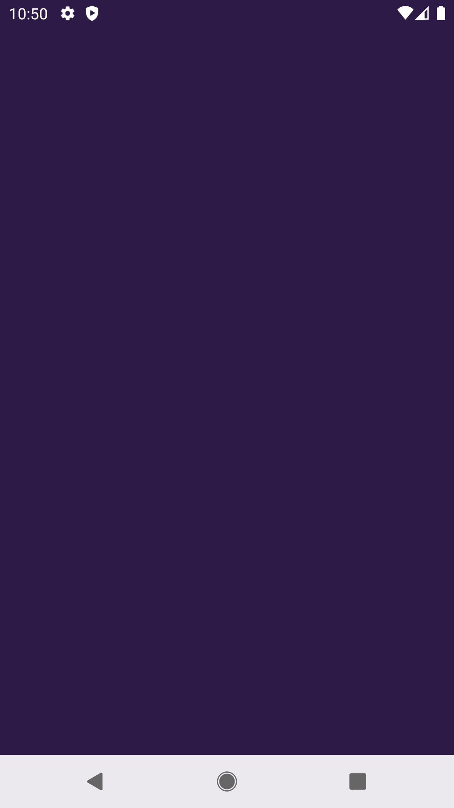
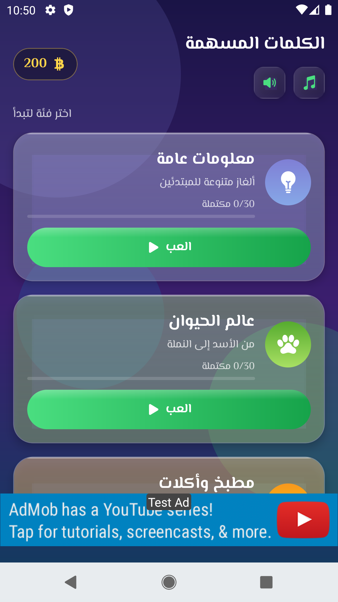
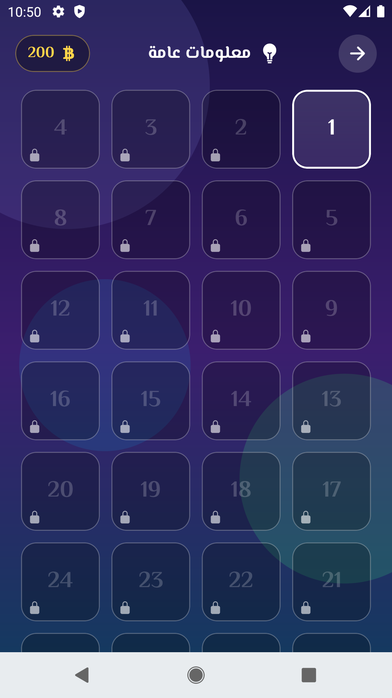
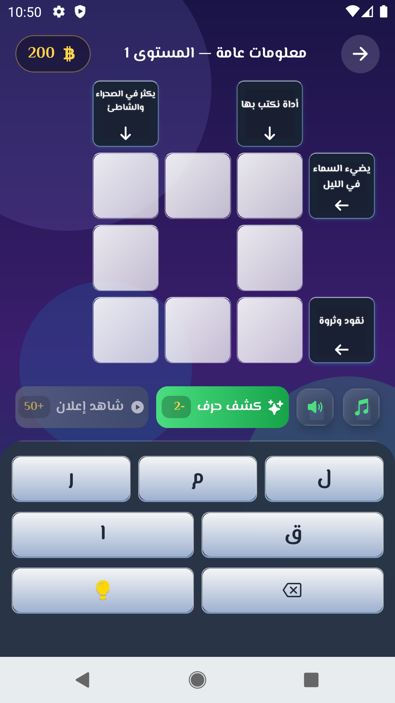

# سهم وحرف (Arrow & Letter)



"سهم وحرف" (Arrow & Letter) is an engaging and educational Arabic crossword puzzle game built with React Native. It tests players' vocabulary, general knowledge, and linguistic skills through challenging, beautifully designed grids. 

## 📸 Screenshots

| Landing | Categories | Level Selection | Gameplay |
|:---:|:---:|:---:|:---:|
|  |  |  |  |

## 🚀 Features

- **Beautiful Modern UI:** Crafted using React Native and `react-native-linear-gradient` with glowing neon glassmorphism effects.
- **Custom Fonts:** Uses elegant Arabic typography (`El Messiri`).
- **Smooth Animations:** Powered by `react-native-reanimated` for 60fps gesture and layout animations.
- **Engaging Gameplay:** Word puzzles where clues are placed directly inside the grid with directional arrows.
- **Progress Tracking:** Automatic saving using `zustand` with `react-native-mmkv` for ultra-fast local storage.
- **Monetization & Analytics:** Integrated with Google AdMob (Banner, Interstitial, and Rewarded Hints) and Firebase Analytics / Crashlytics.
- **Audio & Haptics:** Delightful background music, sound effects, and haptic feedback to enhance the player experience.

## 🛠 Tech Stack

- **Framework:** React Native (v0.87)
- **State Management:** Zustand
- **Storage:** React Native MMKV
- **Animations:** React Native Reanimated
- **Icons:** Ionicons (react-native-vector-icons)
- **Services:** Google Firebase (Crashlytics, Analytics), Google AdMob

## 🏃‍♂️ How to Run Locally

### Prerequisites
- Node.js (v18+)
- Android Studio & Android SDK
- Ruby & Cocoapods (for iOS)

### Installation
1. Clone the repository:
   ```bash
   git clone git@github.com:redonedl/SahmWaHarf.git
   cd SahmWaHarf
   ```
2. Install dependencies:
   ```bash
   npm install
   ```
3. Run on Android:
   ```bash
   npm run android
   ```
4. Run on iOS:
   ```bash
   cd ios && pod install && cd ..
   npm run ios
   ```

## 📦 Deployment

This app is configured to be deployed to the **Google Play Store**. 
To build the Android App Bundle (`.aab`):

```bash
cd android
./gradlew clean
./gradlew bundleRelease
```
The resulting file will be located at `android/app/build/outputs/bundle/release/app-release.aab`.

## 📄 License
All rights reserved.
